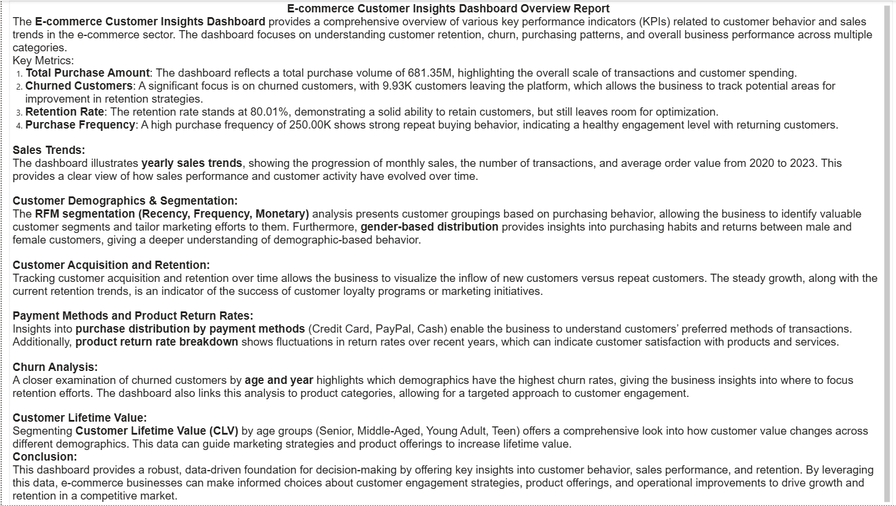

# 📊 Ecommerce Customer Insights Dashboard

This repository contains a **Power BI dashboard** that analyzes customer insights for an e-commerce business.  
It focuses on **sales trends, churn analysis, RFM segmentation, retention, and customer lifetime value**, helping businesses make data-driven decisions.  

## 🚀 Key Metrics
- **Total Purchase Amount** → $681.35M overall transactions  
- **Churned Customers** → 9.93K customers lost  
- **Retention Rate** → 80.01% (good but with scope for improvement)  
- **Purchase Frequency** → Avg. 5.03 transactions per customer  

## 📈 Dashboard Preview

## 📝 Insights Report

## 🔍 Analysis Highlights
- **Sales Trends** → Yearly progression of sales, transactions, and average order value (2020–2023).  
- **Customer Demographics & Segmentation** →  
  - RFM (Recency, Frequency, Monetary) segmentation  
  - Gender-based purchase distribution  
- **Customer Acquisition & Retention** → Tracking new vs repeat customers over time  
- **Payment Methods** → Distribution across Credit Card, PayPal, and Cash  
- **Return Rates** → Product return breakdown by categories  
- **Churn Analysis** → Identifying churn trends by age group and year  
- **Customer Lifetime Value (CLV)** → Value comparison across Senior, Middle-aged, Young Adult, and Teen groups  

## 📂 Repository Contents
- `Ecommerce_Dashboard.pbix` → Power BI file  
- `E-commerce Customer Insights Dashboard.png` → Dashboard Screenshot  
- `Report.png` → Report Screenshot  

## 🛠️ Tools & Technologies
- **Power BI** → Dashboard creation & visualization  
- **E-commerce Dataset** → Customer transactions & behavior  

## 📌 Conclusion
This dashboard delivers **actionable insights** into customer behavior, helping businesses:  
✔ Improve retention strategies  
✔ Minimize churn  
✔ Optimize product offerings  
✔ Increase customer lifetime value  
